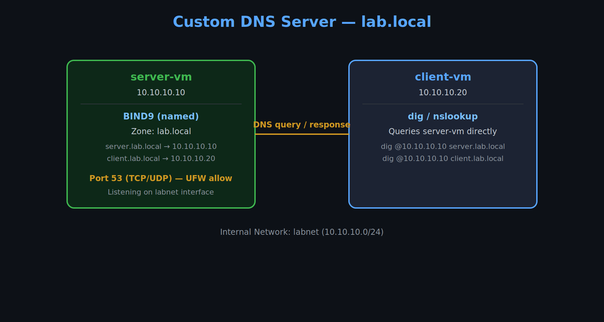

# Custom DNS Server (BIND9)

A self-hosted DNS server using BIND9 on Ubuntu Server, serving a custom local domain (`lab.local`) and resolving hostnames to internal lab network IPs. Tested across two separate VMs to confirm real network-level resolution, not just local lookups.



## What this covers

- **DNS server setup** — Installed and configured BIND9, including a custom forward zone.
- **Zone file authoring** — Wrote a zone file with SOA, NS, and A records mapping hostnames to IPs.
- **Cross-network testing** — Verified resolution from a separate client machine (`client-vm`), not just locally on the DNS server itself.
- **Firewall troubleshooting** — Diagnosed and fixed a UFW rule blocking DNS traffic (port 53) between machines.

## Architecture

| Host | Role | IP |
|---|---|---|
| `server-vm` | DNS server (BIND9) | `10.10.10.10` |
| `client-vm` | DNS client (testing) | `10.10.10.20` |

| Hostname | Resolves to |
|---|---|
| `server.lab.local` | `10.10.10.10` |
| `client.lab.local` | `10.10.10.20` |

## Setup steps

1. **Install BIND9**:
```bash
   sudo apt update
   sudo apt install -y bind9 bind9utils dnsutils
```
2. **Define the zone** in `/etc/bind/named.conf.local`:
3. **Create the zone file** (`/etc/bind/db.lab.local`) with SOA, NS, and A records.
4. **Validate the config**:
```bash
   sudo named-checkzone lab.local /etc/bind/db.lab.local
   sudo named-checkconf
```
5. **Restart BIND9**:
```bash
   sudo systemctl restart bind9
```
6. **Test locally**:
```bash
   dig @localhost server.lab.local
```
7. **Test from a separate machine** (the real validation):
```bash
   dig @10.10.10.10 server.lab.local
```

## Troubleshooting case study: DNS blocked by firewall

**Problem:** `dig @10.10.10.10 server.lab.local` from `client-vm` timed out, even though the same query worked fine locally on `server-vm`.

**Diagnosis:**
- Local resolution worked, ruling out a BIND configuration problem.
- The failure was specific to cross-network queries, pointing to something blocking traffic between the two VMs.
- `sudo ufw status verbose` on `server-vm` showed a `deny incoming` default policy with no rule allowing port 53.

**Fix:**
```bash
sudo ufw allow 53/tcp
sudo ufw allow 53/udp
```

**Lesson:** DNS uses both UDP (standard queries) and TCP (larger responses), so both protocols need an explicit firewall rule. This mirrors the same diagnostic pattern from the Docker DNS issue — confirm what works locally, then isolate exactly which layer breaks across the network.

## Tools used

- Oracle VirtualBox
- Ubuntu Server (LTS)
- BIND9 (named)
- dnsutils (`dig`)
- UFW (Uncomplicated Firewall)

## Author

[Landry5545](https://github.com/Landry5545)